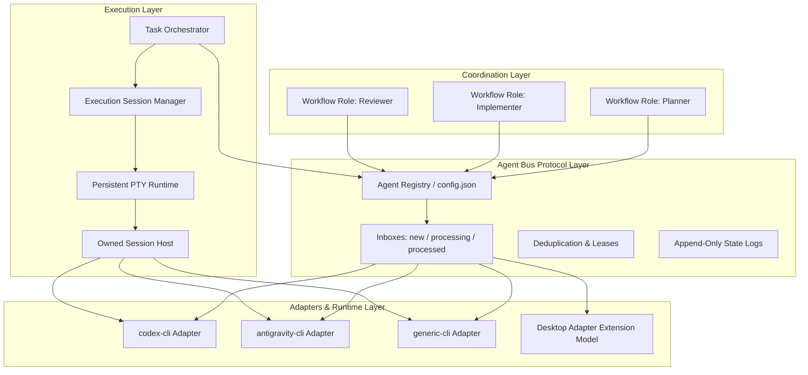

# coordinate-agents

[简体中文](./README.zh-CN.md) | English

A local-first coordination protocol and runtime for AI coding agents. Coordinate multi-agent development in the same Git repository through a recoverable, project-local `.agent-bus`. The core is agent-agnostic and uses an adapter-based runtime. **OpenAI Codex App/CLI** and **Google Antigravity CLI (`agy`)** serve as first-party reference adapters and the default reference workflow, while generic CLI agents can be registered directly and desktop, MCP, HTTP, or IPC execution surfaces integrate through the adapter extension model.

No external CAO server, daemon, database, or shared API credential is required.
While a task is active, the canonical Runtime may create a short-lived,
Runtime-owned local Session host for the Implementer's persistent PTY; this is
not a Codex App Terminal panel and is not an external service.

## Codex Plugin via GitHub Marketplace (Recommended)

Add the official repository as a Codex plugin marketplace:

```sh
codex plugin marketplace add hogancv/coordinate-agents
```

Install the plugin from the marketplace:

```sh
codex plugin add coordinate-agents@coordinate-agents
```

*(You can also browse and enable it via `/plugins` in Codex.)*

Once installed, start a new thread in Codex and invoke it directly via `$coordinate-agents`:

```text
Use $coordinate-agents to coordinate Codex and Antigravity to implement this feature.
```

**Plugin-only means Plugin-only:** a normal Codex Plugin user does **not** need
`npm install -g @hogancv/coordinate-agents`. Each Skill resolves the bundled
canonical Runtime from the active Plugin payload and invokes it with Node; it
does not assume that `coordinate-agents` is on `PATH`. The resolver also works
for a personal marketplace checkout and the cached Git marketplace layout,
including Windows paths containing spaces.

The Plugin is the preferred product surface and is organized as focused Skills:
`coordinate-agents` routes intent, `coordinate-setup` discovers and configures an
Implementer, `coordinate-task` owns the durable Task lifecycle, `coordinate-review`
checks commits and evidence, and `coordinate-recover` diagnoses explicit recovery.
Codex remains Planner/Reviewer while any configured local coding CLI can be the
Implementer; Codex and Antigravity are reference adapters, not a product lock-in.

The three first-use prompts are intentionally an onboarding path:

1. `Check which coding CLIs are available on this computer and help me configure Coordinate Agents.`
2. `Help me choose and configure an available CLI as the implementation agent.`
3. `Use $coordinate-agents to build a simple Todo web app in the current project.`

The normal Plugin path is **Install Plugin → Discover → Configure → Build**:

1. Use `coordinate-setup` to discover real executable facts without changing configuration.
2. Choose an executable and let `coordinate-setup` run one high-level `setup configure` transaction;
   it writes the user command, registers the project Agent, assigns the Implementer role, checks the
   Adapter contract and executable, then returns `READY`.
3. Let Codex clarify the requirement and acceptance criteria, then use `coordinate-task` to create
   and dispatch the approved specification. The Task API owns the Agent Bus handoff and launch.
4. Let `coordinate-review` inspect the commit/evidence and record `REVIEW_APPROVED` or
   `CHANGES_REQUESTED` without editing the Task file directly.

The normal machine path is structured MCP, not generated shell commands:

```text
User <-> Codex
  -> Skills
  -> Coordinate Agents MCP Tools
  -> Canonical Runtime
  -> Task API
  -> Agent Bus
  -> External Implementer
```

The Plugin exposes `coordinate_agents_setup_discover`,
`coordinate_agents_setup_configure`, the Task create/dispatch/status/inspect/
review/resume/stop tools, `coordinate_agents_recover_inspect`, and the bounded
Session tools `coordinate_agents_session_open/status/inspect/write/read/close`.
MCP and CLI call the same Runtime operations and return the same canonical
error contract.

Only when MCP is unavailable, or for explicit debugging, use the fallback:

```text
node "<skill-dir>/../coordinate-agents/scripts/runtime-entry.mjs" <command> ...
```

`<skill-dir>` is the absolute directory containing the active Skill's `SKILL.md`; the Skill supplies
that concrete path. The resolver starts the one canonical `bin/coordinate-agents.mjs` from the Plugin
payload. Do not silently retry between MCP and fallback.

See [MCP tools and integration](./docs/mcp.md) for the stdio lifecycle, schemas,
error semantics, fallback behavior, and release safety. If the Plugin loads but
the tools are not callable, use the [MCP troubleshooting guide](./docs/MCP_TROUBLESHOOTING.md).

## Advanced: standalone npm Runtime and debugging

The npm CLI remains available for standalone Runtime use, automation, compatibility installations,
and debugging. It is not required by the Plugin onboarding path:

```sh
npx @hogancv/coordinate-agents@latest setup --json
npx @hogancv/coordinate-agents@latest task create --title "Build a Todo web app" --json
npx @hogancv/coordinate-agents@latest task dispatch --id task-... --spec "<approved specification>" --json
npx @hogancv/coordinate-agents@latest task status --json
npx @hogancv/coordinate-agents@latest task inspect --id task-... --json
npx @hogancv/coordinate-agents@latest task review --id task-... --decision REVIEW_APPROVED --json
npx @hogancv/coordinate-agents@latest task resume --id task-... --json
```

`--json` emits one stable JSON document; the npm CLI is the Runtime/fallback and
advanced-debugging surface rather than the primary onboarding path. Existing
Agent Bus commands remain available underneath the Task abstraction. Do not use
the npm commands above as evidence that a Plugin user must install a global npm
package.

## Use it directly in Codex App (recommended)

If you use Codex App, you do not need to open two CLI windows or manually paste two launch
commands. After installing the Codex plugin:

1. Add or open the target Git repository as a project in Codex App.
2. Set the thread's project/workspace path to the repository root—the directory containing `.git`.
3. Start a new thread and invoke `$coordinate-agents`.
4. Ask Codex to initialize or coordinate the task in that project.

The Codex App thread handles the Planner/Reviewer side and the Runtime opens or reuses a persistent
Execution Session for the configured Implementer CLI. The Session owns its local PTY process and
bounded input/output; it is independent of the Codex App Terminal UI. The Implementer CLI still
must be installed and its executable command must be correct. `agy` and `claude` are executable
command examples, not workflow-role names:

```sh
# Use the Antigravity CLI executable for the default Implementer.
npx @hogancv/coordinate-agents config set agent.antigravity.command agy

# Register Claude Code as a custom Implementer executable. Verify the flags with
# `claude --help`; the runtime already uses the project root as the child cwd.
npx @hogancv/coordinate-agents@latest agent add claude --adapter generic-cli --command claude \
  --args '["--print", "{prompt}"]'
```

Use the exact command that starts the executable on the local machine (`agy`, `claude`, or a
vendor-specific wrapper). A wrong command or wrong project path prevents the App thread from
finding the project or launching the Implementer; `doctor` can show the final resolved command.

For another CLI, the recommended Codex App setup is to ask the active AI to inspect that CLI first
instead of copying a vendor-specific argument list:

```text
Use $coordinate-agents to configure Claude Code as the Implementer for this project. First inspect
the installed `claude` executable and `claude --help`, register it with `generic-cli`, choose only
the flags this installed version supports for the prompt and project root, run `doctor`, and show
me the resolved configuration. Do not start a collaboration task until I confirm.
```

`generic-cli` supports the `{prompt}`, `{root}`, `{agent}`, and `{lang}` argument placeholders. The
runtime also starts the child process with the selected project root as its working directory, so
do not assume a `--dir` flag exists. Verify each CLI's own help output before saving `args`.
For a persistent Session, configure an interactive argument contract; a one-shot `{prompt}`
template is not silently converted into a conversation.

### Permission flags are explicit

The legacy one-shot `antigravity-cli` launch appends only the configured arguments followed by
`--prompt-interactive <prompt>`. A persistent Execution Session starts with the configured
arguments and `--prompt-interactive`, then writes the first instruction through the PTY unless
the configured arguments explicitly include `{prompt}`. It does **not** automatically append
`--dangerously-skip-permissions`, a sandbox bypass, or another vendor-specific full-permission flag.
If `agy` is already configured locally for full permissions, that native configuration remains in
effect; the Plugin does not override it. If the installed `agy --help` confirms the explicit flag is
what you want, configure it deliberately:

```sh
npx @hogancv/coordinate-agents@latest config set agent.antigravity.args '["--dangerously-skip-permissions"]'
npx @hogancv/coordinate-agents@latest config list
```

Do not copy this flag to another CLI or version without checking its help output. `doctor` verifies
the executable and version, not whether a provider has full permissions enabled.

## 60-second quick start

The following is the CLI fallback for automation or environments without Codex App. Prerequisites:
Node.js 18+, Git, and installed `codex` and `agy` commands (or custom registered agents). Each CLI
owns its authentication; Coordinate Agents does not preflight login state.

From your Git repository, run:

```sh
npx @hogancv/coordinate-agents@latest install
npx @hogancv/coordinate-agents@latest quickstart --template feature --task "Build a Todo web app with add, complete, delete, and local persistence"
```

`quickstart` initializes the local bus and prints exactly two short, copyable commands:

1. Paste the **Codex** command into terminal 1.
2. Paste the **Antigravity** command into terminal 2.
3. Continue talking only to Codex; Antigravity receives implementation work through the bus.

No role prompt needs to be copied or maintained manually. Choose `--template bug`, `--template feature`, or `--template refactor` for the initial task; for later work, give Codex a new requirement following the same checklist.

The CLI `quickstart` path remains a compatibility workflow with its two explicit terminals. The
Plugin Task path uses a persistent Execution Session: dispatch opens one PTY, reuses it for later
`CHANGES_REQUESTED` rework, and closes it only through explicit Session/Task lifecycle operations.
The older `launch` command remains Adapter-driven and may use its legacy bus-supervised behavior;
that compatibility supervisor is separate from the canonical Plugin Session Manager.

### Configure the Implementer executable

Machine-specific executable preferences live outside the installed Skill/Plugin:

```text
~/.coordinate-agents/config.json
```

Configure a custom Antigravity command without editing `skills/` or `.codex-plugin/`:

```sh
npx @hogancv/coordinate-agents config set agent.antigravity.command agy-proxy
npx @hogancv/coordinate-agents config get agent.antigravity.command
npx @hogancv/coordinate-agents config list
```

Command resolution is explicit and fail-closed: **project agent command > user command > Adapter
default** (`agy` for `antigravity-cli`, `codex` for `codex-cli`). An unavailable explicit command
is never silently replaced by `agy` or another fallback. Both `task dispatch` and `session open`
check the final executable before starting the Implementer; spawn failures, non-zero exits, and
conversation/runtime failures set the Task/Session to an observable error, preserve bounded
stdout/stderr tails, and stop. The Planner must stop waiting and must not automatically retry.

Agent identity is not executable identity: `antigravity` configured with `agy-proxy` launches
`agy-proxy` exactly. Project configuration wins over user configuration, and user configuration
wins over the adapter default.

`doctor` reports the final resolved command and executable status. It does not check login state,
provider health, or model availability; those errors are handled as runtime failures by `launch`.


The recording is generated from a real isolated Git repository by `npm run demo` demonstrating the default reference workflow. It exercises requirement submission, Antigravity's implementation and commit, automated tests, Codex's commit/evidence review, and `REVIEW_APPROVED`. The sanitized source transcript is in [`assets/demo-transcript.txt`](./assets/demo-transcript.txt).

## Let an AI install it

The repository includes a single canonical, bilingual [AI installation guide](./AI_INSTALL.md).
Give an AI assistant one of these prompts; it must verify the official identity, avoid credentials
and unknown scripts, run `doctor`, and stop before starting a collaboration task.

**Install both agents**

```text
Install coordinate-agents from the official repository https://github.com/hogancv/coordinate-agents. First read AI_INSTALL.md at the repository root and verify the repository owner, npm package name, latest stable version, and installation impact. Then follow the document to install it for both Codex CLI and Antigravity CLI. After installation, run doctor --lang en and report the results. Do not use a third-party fork, request credentials, modify my product code, or start a collaboration task before verification succeeds.
```

**Install Codex only**

```text
Install the Codex skill from the official hogancv/coordinate-agents repository. First read AI_INSTALL.md and verify the official npm package, then install only the Codex side. After installation, run doctor --codex --lang en. Do not modify the current project code.
```

**Install Antigravity only**

```text
Install the Antigravity skill from the official hogancv/coordinate-agents repository. First read AI_INSTALL.md and verify the official npm package, then install only the Antigravity side. After installation, run doctor --antigravity --lang en. Do not modify the current project code.
```

## Architecture: Agent Bus, Adapters, and Roles



### Three architectural layers

1. **Coordination Layer**: Maps workflow roles (`planner`, `implementer`, `reviewer`) to registered agents and manages human release authorization.
2. **Agent Bus Protocol Layer**: Core message bus, queue lifecycle, lease sidecars, append-only states, and crash recovery. Independent of vendor-specific transports.
3. **Execution Layer**: Keeps Task state separate from a project/Agent-scoped `Execution Session`. The Session Manager reuses healthy Sessions, the PTY Runtime owns bounded interactive I/O, and the Session Host owns only the process it created.
4. **Adapter & Runtime Layer**: Bridges concrete execution surfaces (built-in `codex-cli`, `antigravity-cli`, dynamic `generic-cli`, and desktop adapter extension model) with structured tasks. It never automates the Codex App Terminal UI.

### Agent Identity vs Workflow Role

- **Agent Identity**: Identifies a specific engine and transport (e.g. `codex`, `antigravity`, `claude`, `my-bot`). Configured under `.agent-bus/config.json`.
- **Workflow Role**: Defines functional responsibility in a development loop:
  - **Planner / Reviewer** (Default: `codex`): Clarifies user intent, drafts specifications under `.agent-bus/specs/`, verifies test/build evidence, and controls release gates. Never touches implementation files.
- **Implementer** (Default: `antigravity`): Exclusive product-code and test writer. Implements features, runs validation, commits changes, and submits evidence under `.agent-bus/evidence/`. Never performs releases.

An `Execution Session` is independent of those roles. A Task stores a `sessionId` reference; the
Session Manager keys reuse by repository root, Agent identity, and effective executable. Healthy
Sessions survive Task review rounds, so `CHANGES_REQUESTED` rework is written to the same PTY
context. A failed or exited Session is reported as a fact and is replaced only by an explicit
dispatch path.

### Compatibility criteria

Any agent or adapter connecting to the Agent Bus must support:
- **Receive**: Claim incoming tasks from `inbox/<agent_id>/new` via atomic move to `processing`.
- **Execute**: Run task instructions within the local Git repository workspace.
- **Observe**: Track runtime state (`idle`, `working`, `completed`, `failed`, `waiting`).
- **Result**: Record output artifacts, commit hashes, or review findings.
- **Report**: Write state logs and send atomic handoff messages.

## Dynamic agent registration

Register third-party or custom CLI agents without modifying bus code:

```sh
# Register a custom CLI agent (the default is the positional prompt argument)
npx @hogancv/coordinate-agents@latest agent add my-agent --adapter generic-cli --command my-agent

# List registered agents and workflow configuration
npx @hogancv/coordinate-agents@latest agent list

# Verify all registered agents and their CLI adapters
npx @hogancv/coordinate-agents@latest agent doctor
```

If a CLI needs flags, add an `--args` JSON array only after checking that CLI's own help output.
Supported placeholders are `{prompt}`, `{root}`, `{agent}`, and `{lang}`; the runtime already uses
the selected project root as the child process working directory.

Run a collaboration with custom role assignments:

```sh
npx @hogancv/coordinate-agents@latest quickstart --planner codex --implementer my-agent --template feature --task "Add search feature"
```

## Requirements

- Windows, macOS, or Linux
- Node.js 18 or newer
- Git
- Codex App with the `coordinate-agents` plugin, or installed Codex CLI (for the Codex reference adapter)
- An installed Implementer CLI such as Antigravity (`agy`), Claude Code (`claude`), or another registered executable

## Contributor & Local Development (Personal Marketplace)

For contributors developing the plugin locally from source:

1. Register your local repository in your personal marketplace (`~/.agents/plugins/marketplace.json`):
   ```json
   {
     "name": "personal",
     "interface": {
       "displayName": "Personal Plugins"
     },
     "plugins": [
       {
         "name": "coordinate-agents",
         "source": {
           "source": "local",
           "path": "<path-to-coordinate-agents-repo>"
         },
         "policy": {
           "installation": "AVAILABLE",
           "authentication": "ON_INSTALL"
         },
         "category": "Productivity"
       }
     ]
   }
   ```
2. Install from the personal marketplace:
   ```sh
   codex plugin add coordinate-agents@personal
   ```

> [!NOTE]
> `@personal` is for local development only; regular users should install via the GitHub marketplace (`@coordinate-agents`).

## Install from npm

The npm compatibility layer `@hogancv/coordinate-agents` provides the coordination CLI, project
initialization, Agent Bus protocol runtime, and Antigravity / legacy Codex skill installation:

- **Quickstart & Runtime**:
  ```sh
  npx @hogancv/coordinate-agents@latest quickstart --template feature --task "Build a Todo web app"
  ```
- **Antigravity Skill (`agy`)**:
  ```sh
  npx @hogancv/coordinate-agents@latest install --antigravity
  ```
- **Legacy standalone Codex Skill**:
  ```sh
  npx @hogancv/coordinate-agents@latest install --codex
  ```
- **Install both CLI skills from npm**:
  ```sh
  npx @hogancv/coordinate-agents@latest install
  ```

The installer copies a permanent skill payload from canonical package sources to:

```text
~/.codex/skills/coordinate-agents
~/.gemini/skills/coordinate-agents
```

It does **not** link either location to the temporary npm cache. Existing package-managed installations are safely backed up before replacement. An unrecognized directory is preserved unless you explicitly pass `--force`; uninstall also refuses a modified copy unless explicitly forced.

Verify the installation:

```sh
npx @hogancv/coordinate-agents@latest doctor
```

`doctor` checks Node.js, Git, `codex`, `agy`, and both installed skill copies. Missing components and package-managed damage receive a suggested repair command based on the detected platform. An unrecognized existing skill directory instead gets a non-destructive instruction to back it up or move it first. On Linux, review the suggestion for your distribution and confirm it supplies Node.js 18+ before running it.

Useful variants:

```sh
# Codex only (legacy standalone)
npx @hogancv/coordinate-agents@latest install --codex

# Antigravity only
npx @hogancv/coordinate-agents@latest install --antigravity

# Explicit update
npx @hogancv/coordinate-agents@latest update

# Chinese output
npx @hogancv/coordinate-agents@latest doctor --lang zh-CN

# Remove package-managed installations
npx @hogancv/coordinate-agents@latest uninstall
```

The installer honors `CODEX_HOME` and `GEMINI_HOME`. Custom roots can also be passed with `--codex-home <path>` and `--antigravity-home <path>`.

Restart both CLIs after installation so they rediscover the skill.

Alternatively, install the command globally and use it without `npx`:

```sh
npm install --global @hogancv/coordinate-agents
coordinate-agents install
coordinate-agents doctor
```

## Task templates

| Template | Use it for | Planner requires before implementation |
| --- | --- | --- |
| `bug` | Defects and regressions | Reproduction, expected vs actual behavior, root cause, minimal fix, regression test |
| `feature` | New user-visible behavior | User value, UX/API, scope, edge cases, compatibility, acceptance criteria |
| `refactor` | Internal restructuring | Invariants, non-goals, green baseline, incremental change, before/after verification |

Examples:

```sh
npx @hogancv/coordinate-agents@latest quickstart --template bug --task "Search crashes on an empty query"
npx @hogancv/coordinate-agents@latest quickstart --template feature --task "Add due dates and an overdue filter"
npx @hogancv/coordinate-agents@latest quickstart --template refactor --task "Extract persistence without changing UI behavior"
```

See [`references/task-templates.md`](./references/task-templates.md) for the information checklist for each template.

## Persistent Execution Sessions

The Plugin Task API treats the coding CLI as a long-lived `Execution Session`, not as a disposable
command invocation. `task dispatch` validates the configured executable, sends the durable
`IMPLEMENT` handoff, and opens or reuses a healthy PTY Session. The Task records `sessionId` but
does not own the Session. A short bounded grace period captures immediate completion evidence;
otherwise the Task remains observable as `WAITING_IMPLEMENTER` while the Session continues.

The normal review loop is:

```text
dispatch -> one PTY Session -> implementation -> REVIEWING
                              ^                    |
                              | CHANGES_REQUESTED |
                              +---- same Session --+
```

Use the MCP Session tools for bounded status, inspection, input, output, and explicit close. They
operate on the Runtime-owned process and structured text only. They do not type into, click, or
otherwise control the Codex App Terminal UI. See the [Session Runtime reference](./skills/coordinate-agents/references/session-runtime.md)
for lifecycle and platform behavior.

## Release gate

`REVIEW_APPROVED` is not release authorization. The planner/reviewer may merge, tag, push, deploy, or publish only after the user enters this exact authorization for the described release plan:

```text
RELEASE_APPROVED
```

## Recovery and waiting

- `wait` polls every five seconds for up to 120 minutes by default.
- Waiting continues only while the CLI session and its Node.js process remain alive.
- A bus-supervised launch also remains alive between clean Agent activations. It observes `new`, Agent-owned `processing`, and `STOPPED` state without claiming work; a non-zero child exit stops supervision and is reported as failure.
- A Planner or Reviewer `wait` also observes the configured Implementer state. If it becomes `ERROR`, `wait` exits non-zero immediately; stop polling, report the failure, and do not automatically resend or retry.
- Messages and state survive terminal restarts. Invoke the skill again to inspect and resume `new` or role-owned `processing` messages.
- `.agent-bus/` is added to the repository's local `.git/info/exclude`, not its tracked `.gitignore`.
- Never let multiple roles perform Git writes at the same time.
- `recover inspect` includes the Task's `sessionId` and bounded Session facts when available. It is
  read-only: it does not restart, replay input, resume a Task, or attach to an arbitrary process.
- Session output is bounded and redacted. The Runtime sends Ctrl+C/termination only to the process
  created by that Session and never controls a Codex App Terminal panel or another desktop window.

Claims have a four-hour lease by default. Recover a message left behind by an interrupted process only after confirming that no matching work, commit, or reply already exists:

```sh
BUS_TOOL="$HOME/.codex/skills/coordinate-agents/scripts/agent-bus.mjs"
REPO="$(git rev-parse --show-toplevel)"
node "$BUS_TOOL" recover --root "$REPO" --agent antigravity --stale-after-seconds 14400
```

Use `--dedupe-key <stable-round-id>` when retrying a send. Concurrent sends with the same sender, recipient, and dedupe key resolve to one message. Message publication uses a same-volume temporary file, flush/close, and atomic rename; claiming uses an atomic rename; completion is idempotent. Invalid messages are quarantined instead of delivered, and status falls back to the newest valid append-only state record.

## Security and data boundary

`.agent-bus/` is **local plaintext working data**, not a secret store. It may contain:

- complete prompts, requirements, specifications, questions, and review comments;
- commit hashes, file paths, validation logs, diffs or source excerpts placed in evidence;
- role state, process/host metadata, message leases, deduplication records, queue history, and
  bounded Session command/exit facts. Session metadata does not persist environment variables.

Do not place access tokens, cookies, passwords, private keys, or unnecessary production data in a bus message. The bus inherits the repository directory's operating-system permissions and is not encrypted by this package. `.git/info/exclude` prevents ordinary Git tracking, but does **not** prevent local administrators, backup tools, cloud-sync clients, malware, or other processes running as your user from reading it. Before sharing diagnostics, inspect and redact `.agent-bus/`.

Normal recovery preserves history. After the collaboration and any audit need are finished, delete all bus data with an explicit confirmation:

```sh
node "$BUS_TOOL" clean --root "$REPO" --confirm DELETE_AGENT_BUS
```

This permanently removes specifications, messages, evidence, reviews, releases, logs, state, leases, and deduplication records under `.agent-bus/`; it does not delete product files or Git commits.

## Manual diagnostics

Normally the skill calls the bus script automatically. For troubleshooting:

```sh
BUS_TOOL="$HOME/.codex/skills/coordinate-agents/scripts/agent-bus.mjs"
REPO="$(git rev-parse --show-toplevel)"

node "$BUS_TOOL" init --root "$REPO"
node "$BUS_TOOL" status --root "$REPO"
```

Supported bus commands: `init`, `send`, `wait`, `complete`, `recover`, `state`, `status`, `agent-add`, `agent-list`, and `clean`.

## Development

```sh
npm test
npm run check
npm run demo
npm pack --dry-run
```

## Distribution and release strategy

- **Primary distribution**: Codex Plugin directly from the GitHub repository marketplace (`https://github.com/hogancv/coordinate-agents`).
- **Compatibility distribution**: npm package (`@hogancv/coordinate-agents`) providing CLI tools, runtime engine, Antigravity skill installation, and legacy standalone Codex skill installation.
- **Workflow status**: CI and automated publishing workflows are paused (`.github/workflows/` disabled). Releases are managed explicitly by maintainers.
- **Documentation site**: GitHub Pages continuously serves the documentation site and `llms.txt` from `/docs`.

## FAQ

### What is coordinate-agents?

It is the official [`hogancv/coordinate-agents`](https://github.com/hogancv/coordinate-agents) npm package and Codex/Antigravity Skill for structured multi-agent coding workflows. Codex owns requirements, specifications, reviews, and release control; Google Antigravity CLI (`agy`) exclusively implements product code and tests, while custom CLI and desktop agents can be dynamically attached.

### How do I use it directly in Codex App?

Install and enable the Codex plugin, add the target Git repository as a Codex App project, and set
the thread project path to the repository root containing `.git`. Start a new thread and invoke
`$coordinate-agents`. You do not need to open two CLI windows manually; the Runtime opens a
project-scoped persistent Execution Session for the configured Implementer. Configure the actual
executable command, such as `agy` or `claude`, and use `doctor` if the project path or command is
not being resolved correctly.

The Session is an independent Runtime-owned PTY host, not the Codex App Terminal UI. Codex remains
Planner/Reviewer; the configured Implementer remains the only product-code writer.

### How do I coordinate Codex CLI and Antigravity CLI?

In Codex App, use the direct App path above. For the CLI fallback, run [`install`](#install-from-npm),
then [`quickstart`](#60-second-quick-start) inside the target Git repository. Open the two commands
it prints in separate terminals and continue giving requirements to Codex.

### How do I use two coding agents in one Git repository?

Use one Git repository and assign Git writes to only one role at a time. In Codex App, the current
thread can coordinate the workflow while the Runtime starts or reuses the configured Implementer
Execution Session; a second manually opened CLI session is not required. The project-local
`.agent-bus` carries specifications, implementation results, review decisions, leases, Session
references, and recovery state without requiring shared credentials.

### How does it prevent two AI agents from editing code simultaneously?

The installed role contract makes Antigravity the exclusive product-code writer. Codex may clarify, specify, inspect commits, review evidence, and operate an explicitly approved release, but it must not edit implementation files. The workflow also forbids concurrent Git writes.

### How do I install a Codex Skill from npm?

Run `npx @hogancv/coordinate-agents@latest install --codex`, restart Codex CLI, and verify with `npx @hogancv/coordinate-agents@latest doctor --codex`. For an AI-operated installation, use the canonical [`AI_INSTALL.md`](./AI_INSTALL.md).

### What are the Codex CLI vs Antigravity CLI roles?

Codex clarifies requirements, produces the specification and acceptance criteria, reviews commits and evidence, requests corrections, and enforces the release gate. Antigravity implements source code and tests, validates UI/browser behavior, fixes build failures, and commits the result; it does not release.

### How do I recover interrupted multi-agent coding work?

Invoke the skill again and inspect `status` plus the recorded Session facts; durable messages, Task
references, and Session metadata survive terminal restarts. Recovery inspection is read-only. Recover
a stale claimed message only after confirming that no corresponding work, commit, or reply exists.
After a terminal Session failure, resume and dispatch explicitly; the Runtime never loops through
automatic retries. See [Recovery and waiting](#recovery-and-waiting).

### What is an Execution Session, and does it control the Codex terminal UI?

An Execution Session is a project/Agent-scoped persistent PTY owned by the Coordinate Agents
Runtime. Task records keep a non-owning `sessionId`, so review rework can reuse the same healthy
coding-agent context. Session tools provide bounded read/write/status/close operations, but they do
not click, type into, or inspect the Codex App Terminal panel or another desktop window.

### Is `.agent-bus` secure?

It is local plaintext working data, not encrypted secret storage. `.git/info/exclude` prevents ordinary Git tracking but does not protect against local processes, administrators, backups, or sync tools. Never put credentials in it; read [Security and data boundary](#security-and-data-boundary) and [`SECURITY.md`](./SECURITY.md).

### How do I uninstall coordinate-agents?

Run `npx @hogancv/coordinate-agents@latest uninstall`. The command removes only recognized, unmodified package-managed installations by default and refuses unknown or modified directories unless you explicitly use `--force`.

## License

[MIT](./LICENSE)
