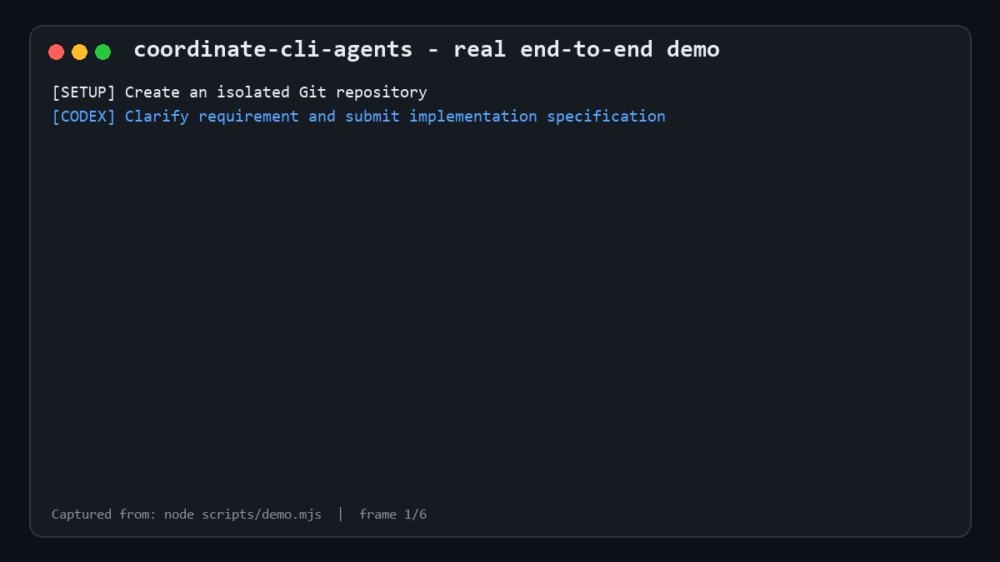

# coordinate-cli-agents

简体中文 | [English](./README.md)

为 **OpenAI Codex CLI** 和 **Google Antigravity CLI（`agy`）**安装一套可持久化、可恢复的协作工作流。两个代理通过项目内的 `.agent-bus` 通信，并保留各自原生账号、订阅和模型权限。

不需要 CAO Server、常驻服务、数据库或共享 API 凭据。

## 60 秒快速开始

前提：已安装 Node.js 18+、Git，并已完成 `codex` 和 `agy` 的账号认证。

在你的 Git 仓库中运行：

```sh
npx @hogancv/coordinate-cli-agents@latest install --lang zh-CN
npx @hogancv/coordinate-cli-agents@latest quickstart --template feature --task "开发 Todo Web 应用，支持新增、完成、删除和本地持久化" --lang zh-CN
```

`quickstart` 会初始化本地总线，并准确输出两条简短、可复制的命令：

1. 把 **Codex** 命令粘贴到终端 1。
2. 把 **Antigravity** 命令粘贴到终端 2。
3. 以后只和 Codex 沟通；Antigravity 会通过总线接收实现任务。

不再需要手动复制或维护两段角色提示词。首次任务可选择 `--template bug`、`--template feature` 或 `--template refactor`；后续工作直接按同一清单向 Codex 提出新需求。



该动图由 `npm run demo` 在真实的隔离 Git 仓库中生成，完整执行需求提交、Antigravity 实现与提交、自动化测试、Codex 审查真实 commit/证据，以及 `REVIEW_APPROVED`。脱敏后的原始记录位于 [`assets/demo-transcript.txt`](./assets/demo-transcript.txt)。

## 让 AI 帮你安装

仓库根目录提供一份统一的中英双语 [AI 安装指南](./AI_INSTALL.md)。把下面任一提示词交给 AI
助手即可；AI 必须先核对官方身份，不得索取凭据或使用未知脚本，安装后必须执行 `doctor`，并在
用户另行要求前停止，不得自动启动协作任务。

**同时安装两个代理**

```text
从官方仓库 https://github.com/hogancv/coordinate-cli-agents 安装 coordinate-cli-agents。先读取仓库根目录的 AI_INSTALL.md，核对仓库所有者、npm 包名、最新稳定版本和安装影响，然后按照文档为 Codex CLI 与 Antigravity CLI 安装。安装完成后运行 doctor --lang zh-CN 验证并向我报告结果。不要使用第三方 Fork，不要索取凭据，不要修改我的产品代码，也不要在验证成功前启动协作任务。
```

**只安装 Codex**

```text
从官方仓库 hogancv/coordinate-cli-agents 安装 Codex 端 Skill。先读取 AI_INSTALL.md 并核对官方 npm 包，仅安装 Codex 端，完成后运行 doctor --codex --lang zh-CN。不要修改当前项目代码。
```

**只安装 Antigravity**

```text
从官方仓库 hogancv/coordinate-cli-agents 安装 Antigravity 端 Skill。先读取 AI_INSTALL.md 并核对官方 npm 包，仅安装 Antigravity 端，完成后运行 doctor --antigravity --lang zh-CN。不要修改当前项目代码。
```

## 环境要求

- Windows、macOS 或 Linux
- Node.js 18 或更高版本
- Git
- 已完成认证的 Codex CLI
- 已完成认证的 Antigravity CLI

## 通过 npm 安装

无需向业务项目添加依赖，即可安装或更新两个 CLI 的技能：

```sh
npx @hogancv/coordinate-cli-agents@latest install
```

安装器会把永久技能副本复制到：

```text
~/.codex/skills/coordinate-cli-agents
~/.gemini/skills/coordinate-cli-agents
```

安装器不会把技能目录链接到可能被清理的 npm 临时缓存。更新前会备份由本包管理的旧安装，包括已修改的受管理副本。来源不明的目录在未明确提供 `--force` 时不会被覆盖；卸载已修改的副本同样必须显式使用 `--force`。

验证安装：

```sh
npx @hogancv/coordinate-cli-agents@latest doctor --lang zh-CN
```

`doctor` 会检查 Node.js、Git、`codex`、`agy` 以及两份技能安装。缺失组件和由本包管理但损坏的安装会得到根据当前平台生成的建议修复命令；无法识别的现有技能目录则会得到先备份或移动的非破坏性操作说明。Linux 用户必须先确认建议适用于自己的发行版且能提供 Node.js 18+，再执行该命令。

常用命令：

```sh
# 只安装 Codex
npx @hogancv/coordinate-cli-agents@latest install --codex --lang zh-CN

# 只安装 Antigravity
npx @hogancv/coordinate-cli-agents@latest install --antigravity --lang zh-CN

# 明确执行更新
npx @hogancv/coordinate-cli-agents@latest update --lang zh-CN

# 卸载由 npm 包管理的技能
npx @hogancv/coordinate-cli-agents@latest uninstall --lang zh-CN
```

安装器支持 `CODEX_HOME` 和 `GEMINI_HOME` 环境变量，也可以使用 `--codex-home <路径>` 和 `--antigravity-home <路径>`指定自定义根目录。

安装后重新启动两个 CLI，使其重新发现技能。

也可以全局安装命令，以后不再通过 `npx` 调用：

```sh
npm install --global @hogancv/coordinate-cli-agents
coordinate-cli-agents install --lang zh-CN
coordinate-cli-agents doctor --lang zh-CN
```

## 开始协作

首次为一个项目配置协作时，运行一次 `quickstart`：

```sh
npx @hogancv/coordinate-cli-agents@latest quickstart --root . --template bug --task "Todo 标题包含 emoji 时保存会崩溃" --lang zh-CN
```

生成的启动命令会调用 `coordinate-cli-agents launch`，从 `.agent-bus/launch/` 读取角色提示词，将工作目录设为正确的仓库，并启动对应的交互式 CLI。仓库路径会编码为 shell 安全参数，因此同一条命令可用于 PowerShell、命令提示符和 POSIX shell。`quickstart` 会拒绝覆盖已有启动提示词，也不会跟随符号链接或目录联接。后续任务直接在现有 Codex 会话中提出；若终端已关闭，则重新运行之前输出的 Codex 启动命令。

## 任务模板

| 模板 | 适用场景 | Codex 在实施前必须明确 |
| --- | --- | --- |
| `bug` | 缺陷和回归 | 复现步骤、预期与实际行为、根因、最小修复、回归测试 |
| `feature` | 新增用户可见功能 | 用户价值、UX/API、范围、边界情况、兼容性、验收标准 |
| `refactor` | 内部结构调整 | 不变量、非目标、全绿基线、增量变更、前后对比验证 |

示例：

```sh
npx @hogancv/coordinate-cli-agents@latest quickstart --template bug --task "空查询导致搜索崩溃" --lang zh-CN
npx @hogancv/coordinate-cli-agents@latest quickstart --template feature --task "增加截止日期和逾期筛选" --lang zh-CN
npx @hogancv/coordinate-cli-agents@latest quickstart --template refactor --task "提取持久化模块且不改变 UI 行为" --lang zh-CN
```

每种模板需要提供的信息清单见 [`references/task-templates.md`](./references/task-templates.md)。

## 工作原理

- **Codex**：澄清需求、编写实现规格、审查真实提交和验证证据、规划发布，并执行获得批准的发布操作；不修改产品代码。
- **Antigravity**：唯一的实现代码编写者，负责源码、测试、UI、构建修复和浏览器验证；不执行发布。

```text
用户需求
   │
   ▼
Codex ── IMPLEMENT ──▶ .agent-bus ──▶ Antigravity
  ▲                                      │
  └── IMPLEMENTATION_DONE + commit ──────┘
   │
   ├── CHANGES_REQUESTED ───────────────▶ 继续修改
   └── REVIEW_APPROVED ─────────────────▶ 等待
```

## 发布门禁

`REVIEW_APPROVED` 只表示审查通过，不等于允许发布。Codex 只有在用户针对已描述的发布计划输入以下精确授权后，才能执行 merge、tag、push、deploy 或 publish：

```text
RELEASE_APPROVED
```

## 恢复与轮询

- `wait` 默认每 5 秒轮询一次，最长等待 120 分钟。
- 只有对应 CLI 会话及其 Node.js 进程仍在运行时，等待才会继续。
- 消息和状态会跨终端重启保留；重新调用技能即可检查并恢复 `new` 或当前角色拥有的 `processing` 消息。
- `.agent-bus/` 只会写入当前仓库本地的 `.git/info/exclude`，不会修改受版本控制的 `.gitignore`。
- 不要让两个角色同时执行 Git 写操作。

消息认领默认带有 4 小时租约。进程中断后，先确认没有对应的实现、commit 或回复，再恢复遗留消息：

```sh
BUS_TOOL="$HOME/.codex/skills/coordinate-cli-agents/scripts/agent-bus.mjs"
REPO="$(git rev-parse --show-toplevel)"
node "$BUS_TOOL" recover --root "$REPO" --role antigravity --stale-after-seconds 14400
```

重试发送时使用 `--dedupe-key <稳定轮次标识>`。相同发送方、接收方和去重键的并发发送只会产生一条消息。消息先写入同卷临时文件，刷新并关闭后再原子重命名；认领也使用原子重命名；重复完成操作是幂等的。损坏消息会被隔离而不会交给代理，状态文件损坏时会回退到最新的有效追加式状态记录。

## 安全边界与数据清理

`.agent-bus/` 是**本地明文工作数据**，不是密钥保险库，其中可能保存：

- 完整提示词、需求、规格、问题和 review 意见；
- commit hash、文件路径、验证日志，以及证据中主动加入的 diff 或源码片段；
- 角色状态、进程/主机信息、消息租约、去重记录和队列历史。

不要写入访问令牌、Cookie、密码、私钥或非必要生产数据。本包不会加密该目录，它只继承仓库目录的操作系统权限。`.git/info/exclude` 只能避免普通 Git 跟踪，**不能**阻止本机管理员、备份工具、云同步客户端、恶意软件或以同一用户运行的其他进程读取。分享诊断信息前，应先检查并脱敏 `.agent-bus/`。

正常恢复不会删除历史。协作结束且不再需要审计记录后，可使用明确确认永久删除总线数据：

```sh
node "$BUS_TOOL" clean --root "$REPO" --confirm DELETE_AGENT_BUS
```

该命令只删除 `.agent-bus/` 下的规格、消息、证据、review、发布记录、日志、状态、租约和去重记录，不删除产品文件或 Git commit。

## 手动诊断

正常使用时由技能自动调用脚本。需要排障时：

```sh
BUS_TOOL="$HOME/.codex/skills/coordinate-cli-agents/scripts/agent-bus.mjs"
REPO="$(git rev-parse --show-toplevel)"

node "$BUS_TOOL" init --root "$REPO"
node "$BUS_TOOL" status --root "$REPO"
```

支持的总线命令：`init`、`send`、`wait`、`complete`、`recover`、`state`、`status` 和 `clean`。

## 开发与发布前检查

```sh
npm test
npm run check
npm run demo
npm pack --dry-run
```

## 发布可信度

- CI 在 Linux、Windows 和 macOS 上测试 Node.js 18、22。
- 只有 GitHub Release 的 `vX.Y.Z` 标签与 `package.json` 完全一致时才允许发布。
- 正式版本使用 npm 标签 `latest`，GitHub 预发布版本使用 `next`。
- `.github/workflows/release.yml` 使用 npm Trusted Publishing（OIDC），不保存长期发布 Token；`publishConfig` 已启用 npm provenance。
- 首次自动发布前，维护者必须在 npm 中为 `hogancv/coordinate-cli-agents` 配置 Trusted Publisher：仓库 `coordinate-cli-agents`、工作流 `release.yml`、允许操作 `npm publish`。

## 常见问题

### coordinate-cli-agents 是什么？

它是官方 [`hogancv/coordinate-cli-agents`](https://github.com/hogancv/coordinate-cli-agents) npm 包和 Codex Skill，用于建立双角色编程工作流。Codex 负责需求、规格、审查和发布控制；Google Antigravity CLI（`agy`）独占产品代码与测试的实现工作。

### 如何让 Codex CLI 和 Antigravity CLI 协作？

先按[通过 npm 安装](#通过-npm-安装)，再在目标 Git 仓库中执行 [`quickstart`](#开始协作)。分别在两个终端运行它输出的两条命令，后续只需继续向 Codex 提需求。

### 如何在同一个 Git 仓库中使用两个编程代理？

使用同一个仓库和两个 CLI 会话，但任何时刻只允许一个角色执行 Git 写操作。项目本地的 `.agent-bus` 负责传递规格、实现结果、审查结论、租约与恢复状态，不共享账号凭据。

### 如何防止两个 AI 代理同时修改代码？

安装后的角色契约规定 Antigravity 是唯一的产品代码编写者。Codex 只能澄清、编写规格、检查提交、审查证据以及执行经明确批准的发布，不得修改实现文件；工作流也明确禁止并发 Git 写操作。

### 如何从 npm 安装 Codex Skill？

执行 `npx @hogancv/coordinate-cli-agents@latest install --codex`，重启 Codex CLI，再执行 `npx @hogancv/coordinate-cli-agents@latest doctor --codex --lang zh-CN` 验证。需要让 AI 代为安装时，请使用规范入口 [`AI_INSTALL.md`](./AI_INSTALL.md)。

### Codex CLI 和 Antigravity CLI 的角色有什么区别？

Codex 澄清需求、编写规格与验收条件、审查提交和证据、要求返工并执行发布门禁。Antigravity 编写源代码与测试、验证 UI/浏览器行为、修复构建问题并提交结果，但不执行发布。

### 如何恢复被中断的多代理开发工作？

重新调用此 Skill 并检查 `status`；消息和状态会跨终端重启保留。只有确认不存在对应实现、提交或回复后，才恢复超时的已认领消息。详见[恢复与轮询](#恢复与轮询)。

### `.agent-bus` 安全吗？

它是本地明文工作数据，不是加密的秘密存储。`.git/info/exclude` 只能避免普通 Git 跟踪，无法阻止本地进程、管理员、备份或同步工具读取。不要写入任何凭据；详见[安全边界与数据清理](#安全边界与数据清理)和 [`SECURITY.md`](./SECURITY.md)。

### 如何卸载 coordinate-cli-agents？

执行 `npx @hogancv/coordinate-cli-agents@latest uninstall --lang zh-CN`。默认只移除可识别且未修改的包管理安装；未知或已修改目录会被拒绝，除非你明确使用 `--force`。

## 许可证

[MIT](./LICENSE)
