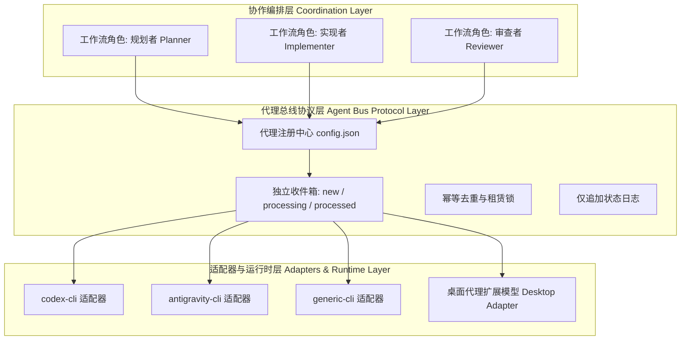

# coordinate-agents

简体中文 | [English](./README.md)

基于本地优先架构的 AI 编程代理协作协议与运行时（Local-first Coordination Protocol & Runtime）。在同一个 Git 仓库内，通过可恢复的项目级 `.agent-bus` 协调多代理开发协作。协议核心与具体代理无关，使用基于适配器的运行时。**OpenAI Codex App/CLI** 与 **Google Antigravity CLI（`agy`）** 作为官方第一方参考适配器与默认参考工作流，同时支持通过 `generic-cli` 动态注册自定义 CLI 代理，并通过适配器扩展模型支持桌面端、MCP、HTTP、IPC 等外部执行环境接入。

无需 CAO Server、常驻后台守护进程、外部数据库或共享 API 凭据。

## 通过 GitHub 市场安装 Codex 插件（普通用户推荐）

将官方 GitHub 仓库添加为 Codex 插件市场：

```sh
codex plugin marketplace add hogancv/coordinate-agents
```

然后从该市场安装插件：

```sh
codex plugin add coordinate-agents@coordinate-agents
```

*(也可以在 Codex 的 `/plugins` 界面中浏览并启用)*

安装完成后，在 Codex 新建线程中输入 `$coordinate-agents` 即可使用：

```text
使用 $coordinate-agents 让 Codex 和 Antigravity 协作完成这个功能。
```

插件是首选产品入口，并拆分为职责清晰的 Skills：`coordinate-agents` 负责意图路由，
`coordinate-setup` 负责发现和配置 Implementer，`coordinate-task` 负责持久化 Task 生命周期，
`coordinate-review` 检查真实 commit 与证据，`coordinate-recover` 负责诊断并在用户明确确认后恢复。
Codex 继续作为 Planner/Reviewer，任何已配置的本机 Coding CLI 都可以作为 Implementer；Codex 和
Antigravity 是参考适配器，不再是产品绑定。

三个首次使用提示词形成 onboarding 路径：

1. `Check which coding CLIs are available on this computer and help me configure Coordinate Agents.`
2. `Help me choose and configure an available CLI as the implementation agent.`
3. `Use $coordinate-agents to build a simple Todo web app in the current project.`

插件背后的 Runtime 提供机器可读的 Task API：

```sh
npx @hogancv/coordinate-agents@latest setup --json
npx @hogancv/coordinate-agents@latest task create --title "开发 Todo Web 应用" --json
npx @hogancv/coordinate-agents@latest task status --json
npx @hogancv/coordinate-agents@latest task inspect --id task-... --json
npx @hogancv/coordinate-agents@latest task resume --id task-... --json
```

`--json` 始终输出单个稳定 JSON 文档；npm CLI 现在是 Runtime、备用和高级调试入口，而不是首次
使用的主路径。现有 Agent Bus 命令继续作为 Task 抽象层之下的实现。

## 直接在 Codex App 中使用（推荐）

如果使用 Codex App，不需要手动打开两个 CLI 窗口，也不需要复制两条启动命令。安装 Codex 插件后：

1. 在 Codex App 中添加或打开目标 Git 项目。
2. 将线程的项目/工作区路径指定为项目根目录，也就是包含 `.git` 的目录。
3. 新建线程并调用 `$coordinate-agents`。
4. 让 Codex 在这个项目中初始化或协调任务。

Codex App 线程负责 Planner/Reviewer 侧，运行时会在本机以子进程方式启动已配置的 Implementer
CLI。执行端 CLI 仍必须已经安装，并且配置的可执行命令必须正确。`agy`、`claude` 是执行命令示例，
不是工作流角色名称：

```sh
# 默认 Implementer 使用 Antigravity CLI 可执行文件
npx @hogancv/coordinate-agents config set agent.antigravity.command agy

# 注册 Claude Code 作为自定义 Implementer 执行端。先用
# `claude --help` 确认本机版本支持的参数；运行时已经把项目根目录作为子进程 cwd。
npx @hogancv/coordinate-agents@latest agent add claude --adapter generic-cli --command claude \
  --args '["--print", "{prompt}"]'
```

请使用本机真正可以启动的执行命令（`agy`、`claude` 或厂商包装命令）。命令配置错误或项目路径错误，
都会导致 App 线程无法找到项目或启动 Implementer；可以用 `doctor` 查看最终解析出的命令。

对于其他 CLI，推荐直接让当前 Codex App 线程先检查本机 CLI，再完成配置，不要照抄厂商参数：

```text
使用 $coordinate-agents，帮我把 Claude Code 配置为这个项目的 Implementer 执行端。请先检查本机
`claude` 可执行文件和 `claude --help`，使用 `generic-cli` 注册，只选择当前版本支持的提示词和项目路径参数，
运行 `doctor` 并展示最终解析配置。配置完成且我确认之前，不要启动协作任务。
```

`generic-cli` 支持 `{prompt}`、`{root}`、`{agent}`、`{lang}` 参数占位符；运行时也会把选定项目根目录作为
子进程工作目录，因此不要假设所有 CLI 都有 `--dir` 参数。保存 `args` 前应以对应 CLI 自己的帮助输出为准。

### 权限参数是显式配置的

内置 `antigravity-cli` Adapter 只会追加已配置的参数，然后追加 `--prompt-interactive <prompt>`，**不会**自动追加
`--dangerously-skip-permissions`、沙箱绕过参数或其他厂商特有的完全权限参数。如果你本机的 `agy` 已经在自身配置中
设置为完全权限，该本地配置会继续生效；插件不会覆盖它。若本机 `agy --help` 确认需要显式传入该参数，可主动配置：

```sh
npx @hogancv/coordinate-agents@latest config set agent.antigravity.args '["--dangerously-skip-permissions"]'
npx @hogancv/coordinate-agents@latest config list
```

不要在未检查帮助输出的情况下把该参数复制给其他 CLI 或其他版本。`doctor` 只验证可执行文件和版本，不能证明
Provider 是否已经开启完全权限。

## 60 秒快速开始

下面是适用于自动化或没有 Codex App 环境的 CLI 备用流程。前提：已安装 Node.js 18+、Git，以及
`codex` 和 `agy` 命令（或使用已注册的自定义代理）。每个 CLI 自己负责认证；Coordinate Agents 不会预检测登录状态。

在你的 Git 仓库中运行：

```sh
npx @hogancv/coordinate-agents@latest install --lang zh-CN
npx @hogancv/coordinate-agents@latest quickstart --template feature --task "开发 Todo Web 应用，支持新增、完成、删除和本地持久化" --lang zh-CN
```

`quickstart` 会初始化本地总线，并准确输出两条简短、可复制的命令：

1. 把 **Codex** 命令粘贴到终端 1。
2. 把 **Antigravity** 命令粘贴到终端 2。
3. 以后只和 Codex 沟通；Antigravity 会通过总线接收实现任务。

不再需要手动复制或维护两段角色提示词。首次任务可选择 `--template bug`、`--template feature` 或 `--template refactor`；后续工作直接按同一清单向 Codex 提出新需求。

参考适配器会声明自己的启动生命周期。Codex 采用一次性交互启动；Antigravity 采用总线监督启动：Agent 正常退出后，同一个 `launch` 进程会继续以非破坏方式等待，后续审查反馈或其他总线消息到达时自动再次启动最终解析出的 Implementer 命令。监督器不会认领消息或创建租约。可按 Ctrl+C 终止，发送 `STOP` 让 Agent 写入 `STOPPED`，或在需要单次激活的脚本中使用与 Agent 无关的 `launch --once` 逃生选项。

### 配置实现者可执行命令

机器相关的可执行文件偏好放在已安装 Skill/Plugin 之外：

```text
~/.coordinate-agents/config.json
```

无需修改 `skills/` 或 `.codex-plugin/`，即可配置自定义 Antigravity 命令：

```sh
npx @hogancv/coordinate-agents config set agent.antigravity.command agy-proxy
npx @hogancv/coordinate-agents config get agent.antigravity.command
npx @hogancv/coordinate-agents config list
```

命令解析采用显式且 fail-closed 的优先级：**项目级 Agent 命令 > 用户级命令 > Adapter
默认值**（`antigravity-cli` 默认 `agy`，`codex-cli` 默认 `codex`）。显式命令不可用时，绝不
静默替换为 `agy` 或其他回退命令。`launch` 会在启动 Implementer 前检查最终可执行文件；
spawn 失败、非零退出和对话/运行时失败都会将 Agent 状态设为 `ERROR`，保留有限长度的
stdout/stderr 尾部，停止监督并报告配置命令与错误。Planner 必须停止等待，不得自动重试。

`doctor` 会报告最终解析出的命令和可执行文件状态，但不会检查登录状态、Provider 健康度或
模型可用性；这些错误由 `launch` 按运行时失败处理。


该动图由 `npm run demo` 在真实的隔离 Git 仓库中生成，完整执行需求提交、Antigravity 实现与提交、自动化测试、Codex 审查真实 commit/证据，以及 `REVIEW_APPROVED`。脱敏后的原始记录位于 [`assets/demo-transcript.txt`](./assets/demo-transcript.txt)。

## 让 AI 帮你安装

仓库根目录提供一份统一的中英双语 [AI 安装指南](./AI_INSTALL.md)。把下面任一提示词交给 AI
助手即可；AI 必须先核对官方身份，不得索取凭据或使用未知脚本，安装后必须执行 `doctor`，并在
用户另行要求前停止，不得自动启动协作任务。

**同时安装两个代理**

```text
从官方仓库 https://github.com/hogancv/coordinate-agents 安装 coordinate-agents。先读取仓库根目录的 AI_INSTALL.md，核对仓库所有者、npm 包名、最新稳定版本和安装影响，然后按照文档为 Codex CLI 与 Antigravity CLI 安装。安装完成后运行 doctor --lang zh-CN 验证并向我报告结果。不要使用第三方 Fork，不要索取凭据，不要修改我的产品代码，也不要在验证成功前启动协作任务。
```

**只安装 Codex**

```text
从官方仓库 hogancv/coordinate-agents 安装 Codex 端 Skill。先读取 AI_INSTALL.md 并核对官方 npm 包，仅安装 Codex 端，完成后运行 doctor --codex --lang zh-CN。不要修改当前项目代码。
```

**只安装 Antigravity**

```text
从官方仓库 hogancv/coordinate-agents 安装 Antigravity 端 Skill。先读取 AI_INSTALL.md 并核对官方 npm 包，仅安装 Antigravity 端，完成后运行 doctor --antigravity --lang zh-CN。不要修改当前项目代码。
```

## 架构：代理总线、适配器与工作流角色



### 三层架构体系

1. **协作编排层 (Coordination Layer)**：将工作流角色（`planner`、`implementer`、`reviewer`）映射到具体代理，并严格管理人类发布审批门禁。
2. **代理总线协议层 (Agent Bus Protocol Layer)**：管理代理注册表、消息生命周期、租赁锁、仅追加状态及崩溃恢复机制，与具体厂商和传输介质解耦。
3. **适配器与运行时层 (Adapters & Runtime Layer)**：桥接具体执行界面（内置 `codex-cli`、`antigravity-cli` 适配器、动态 `generic-cli` 适配器及桌面适配器扩展模型），完成任务输入与执行。

### 代理身份 vs 工作流角色

- **代理身份 (Agent Identity)**：标识具体的执行引擎与传输形式（如 `codex`、`antigravity`、`claude`、`custom-agent`）。在 `.agent-bus/config.json` 中配置。
- **工作流角色 (Workflow Role)**：定义开发闭环中的职责：
  - **规划与审查者 (Planner / Reviewer)**（默认：`codex`）：明确用户需求，在 `.agent-bus/specs/` 编写规格说明，审查 commit 与测试构建证据，管控发布门禁。严禁修改业务实现代码。
  - **实现者 (Implementer)**（默认：`antigravity`）：业务代码与测试的唯一编写者。实现功能、执行验证、提交 commit，并在 `.agent-bus/evidence/` 输出证据。严禁执行发布。

### 兼容性五维准则

任何接入代理总线的代理或适配器需满足：
- **Receive（接收）**：从 `inbox/<agent_id>/new` 原子移动认领任务至 `processing`。
- **Execute（执行）**：在本地 Git 工作区执行任务指令。
- **Observe（观测）**：跟踪标准化运行状态（`idle`, `working`, `completed`, `failed`, `waiting`）。
- **Result（产出）**：记录输出产物、commit 哈希或审查发现。
- **Report（汇报）**：写入状态日志并发送原子交接消息。

## 动态代理注册与扩展

无需修改总线核心代码即可注册第三方或自定义 CLI 代理：

```sh
# 注册自定义 CLI 代理（默认使用位置参数传递提示词）
npx @hogancv/coordinate-agents@latest agent add my-agent --adapter generic-cli --command my-agent

# 列出所有已注册代理及当前工作流角色分配
npx @hogancv/coordinate-agents@latest agent list

# 诊断检查所有已注册代理及其 CLI 适配器可用性
npx @hogancv/coordinate-agents@latest agent doctor
```

如果某个 CLI 需要额外参数，应先检查该 CLI 自己的帮助输出，再添加 `--args` JSON 数组。支持的占位符为
`{prompt}`、`{root}`、`{agent}`、`{lang}`；运行时已经把选定项目根目录作为子进程工作目录。

启动包含自定义角色分配的协作：

```sh
npx @hogancv/coordinate-agents@latest quickstart --planner codex --implementer my-agent --template feature --task "开发搜索功能"
```

## 环境要求

- Windows、macOS 或 Linux
- Node.js 18 或更高版本
- Git
- 已安装并启用 `coordinate-agents` 插件的 Codex App，或已安装 Codex CLI（用于 Codex 参考适配器）
- 已安装的 Implementer 执行端，例如 Antigravity（`agy`）、Claude Code（`claude`）或其他已注册的可执行命令

## 贡献者与本地开发（个人插件市场）

对于在本地修改和调试插件源码的开发者：

1. 在个人插件市场配置文件（`~/.agents/plugins/marketplace.json`）中注册本地仓库路径：
   ```json
   {
     "name": "personal",
     "interface": {
       "displayName": "Personal Plugins"
     },
     "plugins": [
       {
         "name": "coordinate-agents",
         "source": {
           "source": "local",
           "path": "<本地仓库绝对路径>"
         },
         "policy": {
           "installation": "AVAILABLE",
           "authentication": "ON_INSTALL"
         },
         "category": "Productivity"
       }
     ]
   }
   ```
2. 通过个人市场安装：
   ```sh
   codex plugin add coordinate-agents@personal
   ```

> [!NOTE]
> `@personal` 仅供本地开发调试使用，普通用户请使用 GitHub 市场（`@coordinate-agents`）。

## 通过 npm 安装

npm 兼容层 `@hogancv/coordinate-agents` 继续提供命令行工具、项目初始化、Agent Bus 协议运行时及
Antigravity / 旧版独立技能安装能力：

- **快速启动与协作命令**：
  ```sh
  npx @hogancv/coordinate-agents@latest quickstart --template feature --task "开发 Todo 应用"
  ```
- **安装 Antigravity 技能 (`agy`)**：
  ```sh
  npx @hogancv/coordinate-agents@latest install --antigravity --lang zh-CN
  ```
- **安装旧版独立 Codex 技能**：
  ```sh
  npx @hogancv/coordinate-agents@latest install --codex --lang zh-CN
  ```
- **同时安装两个 CLI 技能**：
  ```sh
  npx @hogancv/coordinate-agents@latest install
  ```

安装器会把规范的永久技能副本复制到：

```text
~/.codex/skills/coordinate-agents
~/.gemini/skills/coordinate-agents
```

安装器不会把技能目录链接到可能被清理的 npm 临时缓存。更新前会备份由本包管理的旧安装。来源不明的目录在未明确提供 `--force` 时不会被覆盖；卸载已修改的副本同样必须显式使用 `--force`。

验证安装：

```sh
npx @hogancv/coordinate-agents@latest doctor --lang zh-CN
```

`doctor` 会检查 Node.js、Git、`codex`、`agy` 以及两份技能安装。缺失组件和由本包管理但损坏的安装会得到根据当前平台生成的建议修复命令；无法识别的现有技能目录则会得到先备份或移动的非破坏性操作说明。Linux 用户必须先确认建议适用于自己的发行版且能提供 Node.js 18+，再执行该命令。

常用命令：

```sh
# 只安装 Codex（旧版独立技能）
npx @hogancv/coordinate-agents@latest install --codex --lang zh-CN

# 只安装 Antigravity
npx @hogancv/coordinate-agents@latest install --antigravity --lang zh-CN

# 明确执行更新
npx @hogancv/coordinate-agents@latest update --lang zh-CN

# 中文输出诊断
npx @hogancv/coordinate-agents@latest doctor --lang zh-CN

# 移除由本包管理的安装
npx @hogancv/coordinate-agents@latest uninstall
```

安装器遵循 `CODEX_HOME` 与 `GEMINI_HOME`。也可以使用 `--codex-home <路径>` 和 `--antigravity-home <路径>` 自定义目标目录。

安装后请重启两个 CLI 以便重新发现技能。

或者全局安装命令以便直接使用：

```sh
npm install --global @hogancv/coordinate-agents
coordinate-agents install
coordinate-agents doctor
```

## 任务模板

| 模板 | 适用场景 | 规划者在实现前必须明确的内容 |
| --- | --- | --- |
| `bug` | 缺陷与功能回退 | 复现步骤、预期与实际表现、根因分析、最小修复方案、回归测试 |
| `feature` | 新的用户可见功能 | 用户价值、交互/API 设计、作用域、边界情况、兼容性、验收标准 |
| `refactor` | 内部结构重构 | 不变式约束、非目标说明、绿色基线、增量修改、重构前后对比验证 |

示例：

```sh
npx @hogancv/coordinate-agents@latest quickstart --template bug --task "空查询导致搜索崩溃"
npx @hogancv/coordinate-agents@latest quickstart --template feature --task "添加截止日期与逾期过滤器"
npx @hogancv/coordinate-agents@latest quickstart --template refactor --task "抽离持久化层且不改变 UI 行为"
```

各模板的详细信息清单请参见 [`references/task-templates.md`](./references/task-templates.md)。

## 发布门禁

`REVIEW_APPROVED` 并不是发布授权。只有当用户针对明确说明的发布方案输入完全一致的授权文本时，规划/审查者才可执行分支合并、打标签、推送、部署或发布：

```text
RELEASE_APPROVED
```

## 故障恢复与等待机制

- `wait` 默认每 5 秒轮询一次，最长等待 120 分钟。
- 等待仅在当前 CLI 会话及其 Node.js 进程保持存活时有效。
- 总线监督型 `launch` 也会在 Agent 正常退出后保持存活；它只观察 `new`、该 Agent 所有的 `processing` 和 `STOPPED` 状态，不会代替 Agent 认领任务。子进程非零退出会停止监督并报告失败。
- Planner 或 Reviewer 的 `wait` 也会观测配置中的 Implementer 状态。一旦变为 `ERROR`，`wait` 会立即以非零状态退出；应停止轮询、报告失败，不得自动重发或重试。
- 消息与状态在终端重启后依然保留。再次调用本技能即可检查并继续处理 `new` 或由当前代理认领的 `processing` 消息。
- `.agent-bus/` 写入当前仓库本地的 `.git/info/exclude`，不会污染版本库跟踪的 `.gitignore`。
- 严禁多个角色同时进行 Git 写入。

任务认领默认具有 4 小时租赁期。仅当确认未产生对应工作成果、commit 或回复后，才可回收异常中断的认领：

```sh
BUS_TOOL="$HOME/.codex/skills/coordinate-agents/scripts/agent-bus.mjs"
REPO="$(git rev-parse --show-toplevel)"
node "$BUS_TOOL" recover --root "$REPO" --agent antigravity --stale-after-seconds 14400
```

重发消息时请使用 `--dedupe-key <稳定轮次标识>`。相同发送方、接收方与去重键的并发发送会自动归并为一条消息。消息发布使用同分区临时文件、刷盘并原子重命名；认领使用原子重命名；完成操作具备幂等性。损坏的消息会自动隔离而非交付，状态读取则自动回退至最新有效的仅追加记录。

## 安全与数据边界

`.agent-bus/` 属于**本地明文工作数据**，而非机密存储区。它可能包含：

- 完整的提示词、需求、规格说明、澄清问答与审查评论；
- commit 哈希、文件路径、验证日志，以及证据中的代码片段或 diff；
- 角色状态、进程与主机元数据、消息租赁锁、去重记录与历史队列。
- 请勿在总线消息中放置访问令牌、Cookie、密码、私钥或未经脱敏的生产数据。总线继承当前仓库目录的操作系统权限，本包不对其进行加密。`.git/info/exclude` 仅防止普通的 Git 跟踪，但**不能**阻止本地管理员、备份工具、网盘同步、恶意程序或同权限进程读取。对外提供诊断信息前，请仔细检查并脱敏 `.agent-bus/`。

常规恢复操作会保留历史记录。协作和审计完成后，可使用显式确认彻底清除总线数据：

```sh
node "$BUS_TOOL" clean --root "$REPO" --confirm DELETE_AGENT_BUS
```

该命令会永久删除 `.agent-bus/` 下的所有规格、消息、证据、审查、发布、日志、状态、租赁与去重记录，但不会删除业务代码与 Git commits。

## 手动诊断

通常情况下，Skill 会自动调用总线脚本。如需手动排查：

```sh
BUS_TOOL="$HOME/.codex/skills/coordinate-agents/scripts/agent-bus.mjs"
REPO="$(git rev-parse --show-toplevel)"

node "$BUS_TOOL" init --root "$REPO"
node "$BUS_TOOL" status --root "$REPO"
```

支持的总线子命令：`init`、`send`、`wait`、`complete`、`recover`、`state`、`status`、`agent-add`、`agent-list` 与 `clean`。

## 参与开发

```sh
npm test
npm run check
npm run demo
npm pack --dry-run
```

## 分发与发布策略

- **主要分发渠道**：通过 GitHub 仓库插件市场直接分发官方 Codex 插件（`https://github.com/hogancv/coordinate-agents`）。
- **兼容性分发渠道**：通过 npm 包（`@hogancv/coordinate-agents`）提供 CLI 工具、协议运行时、Antigravity 技能安装器以及旧版独立 Codex 技能安装器。
- **Workflow 状态**：GitHub Actions CI 及自动发布流程已停用（`.github/workflows/` 暂停），所有发布由维护者显式操作。
- **文档网站**：GitHub Pages 持续从 `/docs` 构建托管官方文档站与 `llms.txt`。

## 常见问题 (FAQ)

### 什么是 coordinate-agents？

它是官方发布的 [`hogancv/coordinate-agents`](https://github.com/hogancv/coordinate-agents) npm 包与 Codex/Antigravity Skill，用于结构化多代理编程协作工作流。协议核心与具体代理无关，Codex 默认作为规划者与审查者参考适配器，Google Antigravity CLI（`agy`）默认作为实现者参考适配器，同时支持通过 `generic-cli` 动态接入自定义 CLI 代理，并通过适配器扩展模型支持桌面端等外部环境接入。

### 如何直接在 Codex App 中使用？

安装并启用 Codex 插件后，在 Codex App 中添加目标 Git 项目，并将线程项目路径指定为包含 `.git` 的项目根目录。
新建线程后调用 `$coordinate-agents` 即可。不需要手动打开两个 CLI 窗口；运行时会启动配置好的 Implementer
子进程。请配置真实可执行命令，例如 `agy` 或 `claude`；如果项目路径或命令解析异常，可运行 `doctor` 检查。

### 如何让 Codex CLI 和 Antigravity CLI 协作？

在 Codex App 中使用上面的直接调用方式。CLI 备用流程则是在目标 Git 仓库中先后运行
[`install`](#通过-npm-安装) 和 [`quickstart`](#60-秒快速开始)，再分别在两个独立终端中运行输出的命令。

### 如何在一个 Git 仓库中运行两个编程代理？

在同一个 Git 仓库中确保同一时刻仅允许一个角色拥有 Git 写入权限。Codex App 中当前线程可以负责协作编排，
运行时以子进程启动已配置的 Implementer，不需要手动打开第二个 CLI 会话。项目本地的 `.agent-bus` 用于传递
规格说明、实现结果、审查结论、租赁状态与恢复信息，无需共享 API 凭据。

### 如何防止两个 AI 代理同时修改代码？

通过安装的角色契约，Antigravity 是业务代码的唯一修改者。Codex 负责澄清、编写规格、检查 commit、审查证据与操作经明确授权的发布，但严禁修改实现文件。该工作流同时禁止并发 Git 写入。

### 如何从 npm 安装 Codex Skill？

运行 `npx @hogancv/coordinate-agents@latest install --codex --lang zh-CN`，重启 Codex CLI，并通过 `npx @hogancv/coordinate-agents@latest doctor --codex --lang zh-CN` 进行验证。若由 AI 执行安装，请使用官方标准的 [`AI_INSTALL.md`](./AI_INSTALL.md)。

### Codex CLI 与 Antigravity CLI 的分工是什么？

Codex 负责澄清需求、生成规格说明与验收标准、审查 commit 和证据、指出需要修改的问题，并把关发布门禁。Antigravity 负责实现源码与测试、验证 UI/浏览器行为、修复构建问题并提交 commit；它不执行发布。

### 如何恢复被中断的多代理开发工作？

重新调用本技能并检查 `status`；持久化消息与状态在终端重启后依然保留。仅在确认未产生对应工作成果、commit 或回复后，才可回收过期的认领消息。详见[故障恢复与等待机制](#故障恢复与等待机制)。

### `.agent-bus` 安全吗？

它属于本地明文工作数据，而非加密的机密存储。`.git/info/exclude` 仅防止普通 Git 跟踪，无法防御本地其他进程、管理员、备份工具或同步软件。切勿在其中存储凭据；请阅读[安全与数据边界](#安全与数据边界)和 [`SECURITY.md`](./SECURITY.md)。

### 如何卸载 coordinate-agents？

运行 `npx @hogancv/coordinate-agents@latest uninstall`。该命令默认仅清理可识别且未被修改的受管安装，遇到未知目录或已修改内容时会拒绝删除，除非显式指定 `--force`。

## 许可证

[MIT](./LICENSE)
