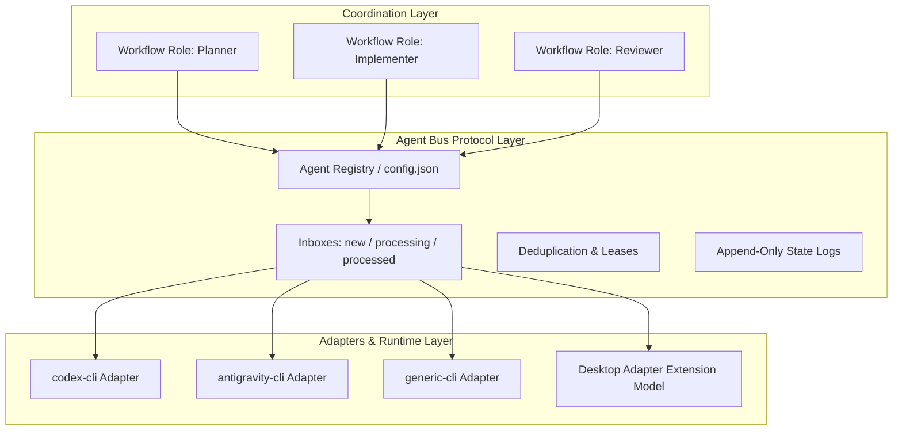

# Agent Bus Protocol and Runtime Architecture

A local-first, serverless coordination protocol and runtime for multi-agent software engineering in Git repositories.



## Architectural layers

1. **Coordination Logic**: maps workflow roles (planner, implementer, reviewer) to registered agents, generates role-specific launch prompts, and enforces specification/review/release policies.
2. **Agent Bus Protocol**: manages agent registry (`.agent-bus/config.json`), message routing, queues, lease sidecars, deduplication, append-only state, and quarantine. The protocol layer is decoupled from vendor implementations and concrete transports.
3. **Agent Adapters / Runtime**: detects CLI availability and resolves launch commands/arguments using argument arrays without shell-string interpolation.

## Agent Identity vs Workflow Role

- **Agent Identity (`agent_id`)**: A unique, persistent identifier (1-64 lowercase alphanumeric chars, `_`, `-`) bound to a concrete runtime adapter and command (e.g., `codex`, `antigravity`, `claude`, `test-bot`).
- **Workflow Role**: A functional responsibility within a collaboration task:
  - `planner`: clarifies requirements, produces specifications, and controls release gates. Default: `codex`.
  - `implementer`: solely writes product source code, tests, and build fixes. Default: `antigravity`.
  - `reviewer`: inspects commits and evidence against acceptance criteria. Default: `codex`.

One agent may fulfill multiple roles (e.g. planner and reviewer), and roles can be reassigned in `.agent-bus/config.json` or via `quickstart --planner <id> --implementer <id>`.

## Dynamic configuration (`.agent-bus/config.json`)

Stored project-locally at `.agent-bus/config.json`:

```json
{
  "version": 1,
  "agents": [
    { "id": "codex", "adapter": "codex-cli" },
    { "id": "antigravity", "adapter": "antigravity-cli" }
  ],
  "workflow": {
    "planner": "codex",
    "implementer": "antigravity",
    "reviewer": "codex"
  }
}
```

- Initialized idempotently by `agent-bus init` or `quickstart`.
- New agents are registered atomically via `coordinate-agents agent add <id> --adapter <adapter> --command <cmd>` or `agent-bus agent-add`.
- Registration creates dedicated inbox stages, state, and quarantine directories for that agent without disturbing existing queues.

### User-level executable configuration

Machine-specific command preferences are stored outside the installed Skill/Plugin at
`~/.coordinate-agents/config.json`:

```json
{
  "version": 1,
  "agents": {
    "antigravity": {
      "command": "agy-proxy",
      "args": []
    }
  }
}
```

Runtime resolution is **explicit project `command` > user-level agent command > Adapter default**.
The project record remains the repository-specific source of truth; the user record is for
machine-specific defaults and survives Skill/Plugin/npm updates. An explicit command that fails
resolution is fail-closed and never falls back to the Adapter default.

## Queues and message routing

Each registered agent owns an isolated queue hierarchy under `.agent-bus/inbox/<agent_id>/`:
- `new/`: incoming messages waiting to be claimed.
- `processing/`: in-flight message claimed by the recipient, accompanied by a `<message>.lease.json` sidecar.
- `processed/`: archived historical messages after completion.

### Message lifecycle

1. **Send**: The sender writes atomically to `.agent-bus/inbox/<to>/new/<timestamp>-<type>-<id>.md`.
2. **Claim/Wait**: Recipient atomically moves the oldest message to `.agent-bus/inbox/<to>/processing/` and creates a lease sidecar.
3. **Complete**: After successful processing, recipient moves the message to `.agent-bus/inbox/<to>/processed/` and removes the lease sidecar.
4. **Quarantine**: If message parsing fails, the message is moved to `.agent-bus/quarantine/<to>/` with an `.error.json` diagnostics file.

When `wait` is running for the configured Planner or Reviewer, it also watches the configured
Implementer's latest state. An Implementer `ERROR` causes `wait` to return a non-zero failure
immediately rather than waiting for the normal timeout; the caller must stop polling and report the
runtime failure.

### Message format

UTF-8 encoded YAML frontmatter followed by Markdown body:

```markdown
---
id: <sha256-or-uuid>
from: codex
to: antigravity
type: IMPLEMENT
created_at: 2026-08-15T08:00:00.000Z
related_commit: <hash>
dedupe_key: <stable-round-key>
subject: "Implement todo completion"
---
# Specification / Content
...
```

### Message types

- `REQUIREMENTS`: raw or clarified user requirements.
- `IMPLEMENT`: implementation-ready specification.
- `IMPLEMENTATION_DONE`: committed implementation plus test and build evidence.
- `CHANGES_REQUESTED`: blocking review findings requiring revisions.
- `REVIEW_APPROVED`: review sign-off.
- `RELEASE_REQUEST`: proposed release plan awaiting human authorization.
- `RELEASE_RESULT`: verified release outcome.
- `QUESTION` / `ANSWER`: structured clarification.
- `STOP`: cleanly terminate the collaboration loop.

## States and diagnostics

### Protocol states (persisted under `.agent-bus/state/<agent_id>/`)

- `IDLE`: ready for new task.
- `CLARIFYING`: asking questions / clarifying scope.
- `SPEC_READY`: specification completed and queued.
- `IMPLEMENTING`: actively editing, testing, or building code.
- `WAITING`: waiting for peer message or review.
- `REVIEWING`: verifying commits and evidence.
- `CHANGES_REQUESTED`: feedback sent to implementer.
- `APPROVED`: review approved.
- `RELEASING`: executing approved release plan.
- `STOPPED`: stopped cleanly.
- `ERROR`: error encountered.

### Adapter-observed normalized states

For adapters observing external or desktop agents:
- `idle`: process available, no task active.
- `working`: process currently executing a task.
- `completed`: task finished with artifacts/evidence.
- `failed`: task ended with error.
- `waiting`: process blocked waiting on input or bus message.

## Adapter subsystem and contracts

Adapters live under `adapters/` and implement a unified interface:

- `detect()`: checks executable availability and version.
- `resolveLaunch({ root, prompt, agent, language, activation })`: returns `{ command, prefix, args }` without shell interpolation.
- executable readiness: the resolved command is checked before launch and returns structured
  `COMMAND_NOT_FOUND`, `COMMAND_NOT_EXECUTABLE`, `UNSAFE_WINDOWS_ENTRYPOINT`, or
  `VERSION_CHECK_FAILED` results where applicable. Launch preflight does not probe authentication,
  provider health, or model availability.
- `launchPolicy()`: returns normalized `one-shot` or `bus-supervised` lifecycle policy.
- `resumePrompt({ agentId, root, activation })`: supplies compact context for a later supervised activation.
- `capabilities()`: reports supported actions (`launch`, `detect`, `dispatch`).

### Reference adapters

1. `codex-cli`: Codex CLI detection and one-shot `-C <root> <prompt>` execution.
2. `antigravity-cli`: Antigravity CLI (`agy`) detection and bus-supervised `--prompt-interactive <prompt>` execution.
3. `generic-cli`: Configurable third-party CLI execution with template arguments (e.g. `["--dir", "{root}", "--message", "{prompt}", "--agent", "{agent}"]`). Supports `{prompt}`, `{root}`, `{agent}`, and `{lang}`; rejects deprecated role placeholders.

### Durable launch supervision

For `bus-supervised` adapters, Runtime performs the first activation normally. After a zero exit it observes the registered Agent's `new` and `processing` queues plus latest state without moving a message or writing a lease. Work wakes a new activation with the Adapter's resume prompt; `STOPPED` ends successfully. A non-zero child exit, spawn failure, launch failure, or reported `ERROR` ends the current activation and stops supervision; no automatic retry or command fallback occurs. Ctrl+C or termination is forwarded to the active non-detached child. `launch --once` disables supervision without naming a vendor.

### Desktop and external adapter extension model

For desktop GUI, MCP, HTTP, or IPC execution surfaces:
1. **Attachment precedence**: Official API/SDK > MCP server > WebSocket/IPC > Local HTTP > CLI bridge > Filesystem watcher > UI automation.
2. **Translation loop**: The adapter polls `.agent-bus`, extracts the prompt, transmits it to the external agent via its preferred bridge, monitors progress, and writes back `IMPLEMENTATION_DONE` or `REVIEW_APPROVED`. The external agent does not need direct `.agent-bus` awareness.

## Git ownership and release gate

- **Sole Implementer Rule**: Only the agent in the `implementer` role may edit product code, tests, and configuration.
- **Planner/Reviewer**: Inspects repository state in read-only mode during development rounds.
- **Human Release Gate**: `REVIEW_APPROVED` does **not** authorize release or deployment. Only the exact user authorization string `RELEASE_APPROVED` permits merge, tag, push, deploy, or publish actions.

## Recovery and cleanup

- **Recovery**: `agent-bus recover --agent <id> --stale-after-seconds <sec>` safely moves abandoned processing messages with expired leases back to `new`.
- **Cleanup**: Permanent removal of `.agent-bus/` requires `agent-bus clean --confirm DELETE_AGENT_BUS`.
